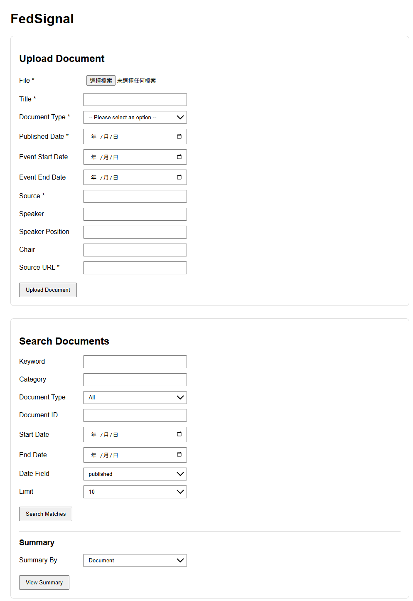
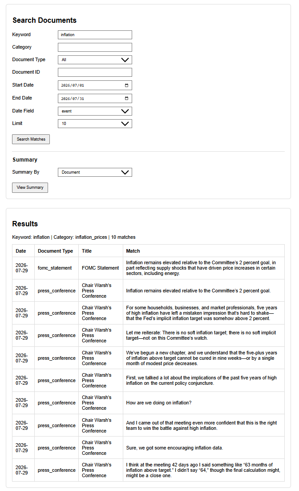
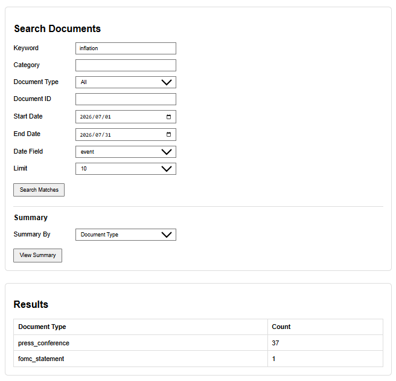

# FedSignal

An asynchronous document-processing system for ingesting, processing, and querying Federal Reserve communications.

## Overview

Federal Reserve communications contain important signals about monetary policy and economic conditions, but analyzing statements, meeting minutes, and press conference transcripts across time can be repetitive and time-consuming.

FedSignal provides an end-to-end pipeline for:

* Ingesting Federal Reserve policy documents
* Processing uploaded documents asynchronously through a persistent job queue
* Extracting and storing structured document content and metadata
* Tracking macroeconomic and monetary-policy keyword occurrences
* Querying historical matches and aggregated summaries through a REST API and web interface

The current implementation focuses on Federal Reserve communications, including FOMC statements, meeting minutes, and press conference transcripts.

## Demo

### Web Interface



### API Response




## Architecture

```text
                         Browser
                            │
                            │  http://localhost:8000
                            ▼
                  ┌──────────────────┐
                  │   FastAPI API    │
                  │      :8000       │
                  └────────┬─────────┘
                           │
             create/read   │   PostgreSQL
          documents & jobs │   postgres:5432
                           ▼
                  ┌──────────────────┐
                  │    PostgreSQL    │
                  │      :5432       │
                  └────────▲─────────┘
                           │
                           │ claim/update jobs
                           │ store processed results
                  ┌────────┴─────────┐
                  │ Background Worker│
                  └──────────────────┘
                           │
                           │ extract / clean /
                           │ chunk / detect keywords
                           ▼
                    Uploaded PDFs

         API + Worker + PostgreSQL run through Docker Compose
```

### Processing Flow

```text
Upload PDF
    │
    ▼
Create document record
    │
    ▼
Create pending processing job
    │
    ▼
Background worker claims job
    │
    ▼
Extract and clean document text
    │
    ▼
Split document into chunks
    │
    ▼
Detect keyword occurrences
    │
    ▼
Store structured results in PostgreSQL
    │
    ▼
Query through API / web interface
```

## Tech Stack

* **Backend:** Python, FastAPI
* **Database:** PostgreSQL
* **Database Access:** SQLAlchemy
* **Frontend:** JavaScript, HTML, CSS
* **Infrastructure:** Docker, Docker Compose

## Key Features

### Document Ingestion

* Upload Federal Reserve policy documents in PDF format
* Store structured document metadata, including:
  * title
  * document type
  * published date
  * speaker information
  * source URL
* Persist raw and processed document information in PostgreSQL
* Automatically create a processing job after ingestion

### Asynchronous Document Processing

* Persistent PostgreSQL-backed job queue
* Background worker independently claims and processes pending jobs
* Prevents multiple workers from claiming the same job
* Tracks processing status through:
  * `pending`
  * `running`
  * `completed`
  * `failed`
* Extracts PDF text, cleans document-specific formatting, and splits documents into searchable chunks

### Keyword Analysis

* Detect macroeconomic and monetary-policy-related keyword occurrences
* Associate matches with their source document and text chunk
* Query matches using filters such as:
  * keyword
  * keyword category
  * date range
  * document type
  * document ID
* Generate grouped summaries by:

  * document
  * document type
  * date

### REST API and Web Interface

The FastAPI backend exposes endpoints for document ingestion and historical keyword analysis.

Example endpoints:

```text
POST /api/documents
GET  /api/reports/matches
GET  /api/reports/summary
```

A lightweight JavaScript frontend provides forms for:

* uploading new documents
* searching keyword occurrences
* filtering historical results
* viewing aggregated summaries

### Dockerized Multi-Service Environment

Docker Compose runs the main application components as separate services:

* FastAPI API
* PostgreSQL database
* background processing worker

The API and worker communicate with PostgreSQL over the internal Docker Compose network.

## Project Structure

```text
FedSignal/
├── app/
│   ├── routes/
│   ├── main.py
│   ├── worker.py
│   └── ...
├── frontend/
│   ├── index.html
│   ├── app.js
│   └── style.css
├── data/
│   ├── raw/
│   ├── processed/
│   └── cleaned/
├── docs/
│   └── images/
│       ├── fedsignal-ui.png
│       ├── api-response-summary.png
│       └── api-response-matches.png
├── scripts/
│   ├── clean_processed_text.py
│   ├── extract_pdf_text.py
│   ├── process_keyword_occurrences.py
│   └── ...
├── docker-compose.yml
├── Dockerfile
├── requirements.txt
└── README.md
```

## Requirements

To run FedSignal with Docker Compose:

* Docker
* Docker Compose

For local Python development:

* Python 3.x
* PostgreSQL
* Python dependencies listed in `requirements.txt`

## Build and Run

### Docker Compose

Build and start the API, worker, and PostgreSQL services:

```bash
docker compose up -d --build
```

Check service status
```bash
docker compose ps
```

Then open:
```text
http://localhost:8000
```

View logs:
```bash
docker compose logs -f
```

Stop the application:
```bash
docker compose down
```

After the initial build, code changes that do not require rebuilding the image can generally be started with:
```bash
docker compose up -d
```

### Local Python Setup

For development outside Docker, create a virtual environment:
```bash
python -m venv .venv
```

Activate it on macOS/Linux:
```bash
source .venv/bin/activate
```

or Windows:
```powershell
.venv\Scripts\activate
```

Install dependencies:
```bash
pip install -r requirements.txt
```

## Example Workflow

1. Start the application using Docker Compose.
2. Open `http://localhost:8000`.
3. Upload a Federal Reserve PDF through the document ingestion form.
4. The API stores the document and creates a pending processing job.
5. The background worker claims the job and processes the document.
6. Extracted text is cleaned, chunked, and analyzed for configured keywords.
7. Processing results are stored in PostgreSQL.
8. Search the processed corpus by keyword, date range, or document type.
9. View individual matches or grouped historical summaries.

## Current Limitations

FedSignal is currently an MVP and focuses primarily on structured keyword-based analysis.

Current limitations include:

* Documents are currently uploaded manually rather than collected automatically from Federal Reserve sources.
* Analysis is based on predefined keywords and categories rather than semantic embeddings.
* Historical aggregation is currently limited to basic grouped summaries.
* The web interface is intentionally minimal and primarily demonstrates backend functionality.
* Processing logic currently focuses on supported Federal Reserve document formats.

## Planned Improvements

Potential future extensions include:

* Time-series keyword frequency analysis
* Trend comparison across policy periods
* Multi-keyword comparison
* Speaker-based analysis
* Automated document collection from Federal Reserve sources
* Expanded processing support for additional central banks
* Semantic search using document embeddings
* Improved monitoring and observability for background jobs
* Automated testing and CI/CD
